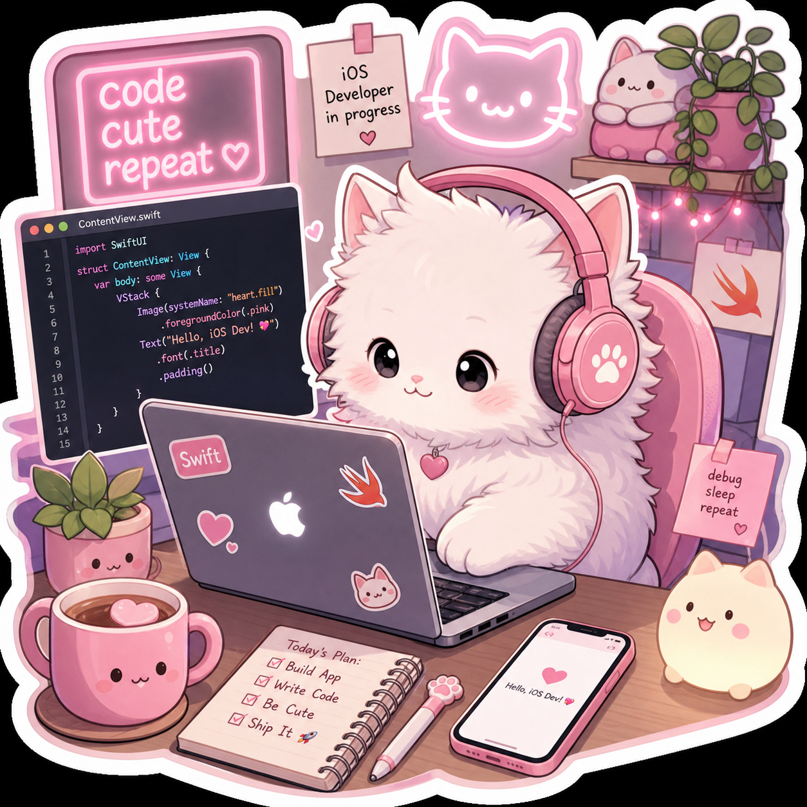

<div align="center">




<a href="https://github.com/katanaban888"></a>

**`на чилле / на вайбе / на коде`** ✨

</div>

---

### 😼 кто я ваще??

> рил ток, я просто девочка/мальчик (нужное подчеркнуть) которая любит свифт и котиков. ноу кэп.

- 📱 **iOS dev** — пишу на Swift, живу в Xcode, это база
- 🐾 **котики > люди** — у меня 100500 фоток котов в галерее и 0 сожалений
- 🎧 чиллю под **lo-fi** и дебажу в 3 ночи — это вайб, это лайфстайл
- ☕️ кофе + код + мур — мой идеальный день, фр
- 💅 слэй ол дэй — мой код тоже должен быть красивым, а не только работать
- 🚀 щас учу **SwiftUI, Combine, TCA** и пытаюсь не сойти с ума

```swift
struct Katanaban888: iOSDeveloper, CatLover {
    let name = "katanaban888"
    let pronouns = "котик / солнышко"
    let vibe = "✨ immaculate ✨"
    
    let stack = ["Swift", "SwiftUI", "UIKit", "Combine", "CoreData", "Firebase"]
    let loves = ["🐱 котики", "📱 iOS", "💖 эстетику", "🎧 phonk / lo-fi"]
    let hates = ["кринж код", "force unwrap", "когда симулятор лагает"]
    
    var status: String {
        "на чилле, кодю аппки и глажу котиков 😼💅"
    }
    
    func meow() -> String {
        "мяу ^_^"
    }
}
```

### 🛠️ мой стак (имба дроп)

<div align="center">


<br/>


</div>

---

### 🐾 котиковый уголок (самое важное)

<div align="center">

| | |
|---|---|
| **`/\_/\`**<br/>**`( o.o )`**<br/>**` > ^ <`** | **мой кот ревьюит PR'ы:**<br/>`// LGTM, но где вкусняшки?` <br/>`// approve, потому что ты милый` |
| **`/\_/\`**<br/>**`( -.-)`**<br/>**`/ >💖`** | **мой кот когда я пишу force unwrap:**<br/>`кринж... удали... мяу` |

**правила жизни от котика-программиста:**

> 1. поел -> поспал -> покодил -> повторил 🔁
> 2. если код не работает — ляг на клаву, станет лучше
> 3. все баги — это просто фичи для котиков


*реальный я когда запускается с первого раза (никогда)*

</div>

---

### 📊 статка (флексим чуть-чуть)

<div align="center">


</div>

---

### 🎧 щас на репите

<div align="center">


`npx meow` — `мяу мяу мяу мяу мяу`

</div>

---

<div align="center">

### 💌 коннектимся?

<a href="https://github.com/katanaban888"></a>


<br/><br/>

**`made with 💖 and 🐾 by katanaban888`**

`code cute repeat ♡`


#### ฅ^•ﻌ•^ฅ meow!

</div>
