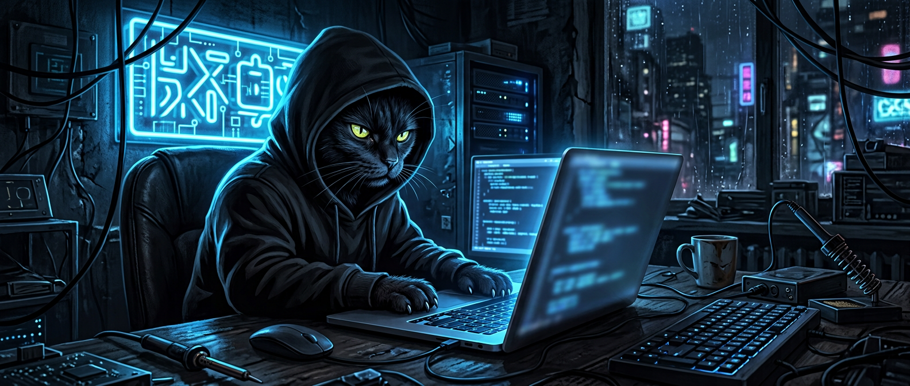

<div align="center">



<br/>


<br/>


<a href="https://github.com/katanaban888"></a>

**`на фокусе / гриндим / шипаем`**

</div>

---

## ⚡ кто я

> йоу, бро. я парень и **iOS девелопер** (he/him). пишу на Swift, живу в Xcode, шипаю фичи в прод и не кринжу. база.

- 📱 **iOS dev** — Swift, SwiftUI, UIKit. это имба, это база
- 🎧 **чиллим** под phonk и ло-фай, а потом **гриндим** до 3 ночи
- 🛠️ держу архитектуру чистой: **Combine, TCA** — без кринжа
- 🚀 **шипаем** в прод, а не сидим в бесконечном рефакторе
- 🐈‍⬛ котики — лучший рантайм-суппорт, и точка

<br/>

```swift
struct Katanaban888: iOSDeveloper {
    let name = "katanaban888"
    let pronouns = "he/him"
    let role = "iOS Developer"

    let stack = ["Swift", "SwiftUI", "UIKit", "Combine", "TCA", "Xcode", "Firebase", "Git"]
    let status = "на фокусе — гриндим"

    let cringeLevel = 0 // без кринжа
    var isSigma: Bool { true }

    func ship() -> App {
        while !isDone { grind() } // code build ship repeat
        return .shipped
    }
}
```

<br/>

<div align="center">


</div>

---

## 🛠️ стек (имба)

<div align="center">


<br/>


</div>

---

## 🐈‍⬛ котиковый отдел (без милоты, только база)

> никакого кавая и сердечек. эти коты пишут код, ревьюят PR'ы и не ноют.

### 🧥 кот в чёрном худи

```
       _____
      /     \
     | o   o |
     |  \_/  |   на фокусе. не мешай гриндить.
      \___/
        |_|
```

### 💻 кот-хакер

```
       __
      /  \
     | x x|    cat /dev/motivation
     | \_/ |   > access granted_
      \___/    hacking the grind_
```

### 🔍 кот сеньор-ревьюер

```
      /\_/\
     ( -.-)    "LGTM? хм..."
      / >^      перепиши. и тесты добавь.
       ||       сеньор честный, а не злой
```

### 🗿 сигма-кот

```
      /\_/\
     ( o.o )   один. тихо. шипаем.
      > ^ <    code. build. ship. repeat.
       ---     база.
```

<br/>

**правила котикового отдела:**

> 1. поел → покодил → пошипел → повторил
> 2. force unwrap — это кринж. пиши `guard`, будь сигма
> 3. билд красный? не ной, дебажь. это база

---

## 📊 стата (tokyonight вайб)

<div align="center">


</div>

---

<div align="center">

### 🤝 коннектимся

<a href="https://github.com/katanaban888"></a>


<br/><br/>

**`made with Swift energy by katanaban888`**

**`code build ship repeat`**


#### без кринжа. только база. йоу.

</div>
